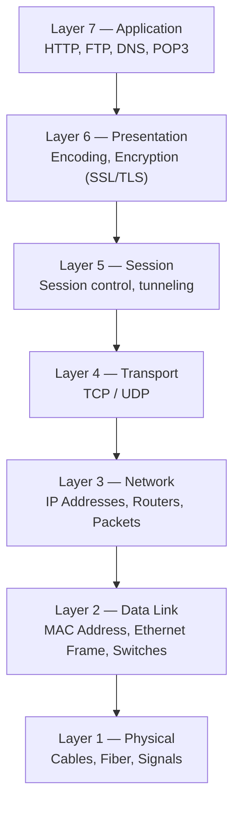
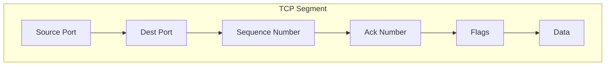

# OSI Model — Network+ Notes

The OSI (Open Systems Interconnection) Model is a 7-layer conceptual framework
that describes how data moves from one device to another across a network.
Each layer has a specific job, and data gets handed down (or up) the stack as
it's sent (or received).

---

## Layer 1: Physical Layer

The "physics" of the network.

- Covers signaling, cabling, and connectors
- This layer is **not** about protocols — it's about the actual physical
  transmission of signals
- **"You have a physical layer problem"** means something like a bad cable,
  bad port, or bad connector
  - Fix: check/replace the cable, redo the punch-down, run loopback tests,
    swap adapter cards

---

## Layer 2: Data Link Layer

This layer handles communication between two devices **on the same local
network**. It's also known as the **MAC Address layer**.

- The basic network "language" — the foundation of communication at this layer
- Uses **Data Link Control (DLC)** protocols
- MAC addresses live on your Ethernet or wireless adapter
- Also called the **switching layer**, because switches operate here
- Key terms: **Ethernet frame**, **MAC Address**, **Switch**
- Every network adapter has a globally unique MAC address, assigned in one of
  two formats:
  - **EUI-48** (48-bit — the traditional/common format)
  - **EUI-64** (64-bit — used in some newer addressing, e.g. IPv6 interface IDs)

> 📝 **Correction:** Your notes wrote this as "EVI-48" / "EVI-64" — the
> correct term is **EUI** (Extended **Unique** Identifier), not EVI.

---

## Layer 3: Network Layer

The **routing layer**. Routers operate here, forwarding traffic based on
**IP addresses** to get data to its destination.

- Routers look specifically at IP addresses to decide where to forward a
  packet next
- Handles **fragmentation** — breaking frames into smaller pieces so they can
  traverse networks with different maximum packet sizes (MTU)
- Key terms: **IP Address**, **Router**, **Packet**

---

## Layer 4: Transport Layer

Responsible for transporting information from one device to another —
often called the **"Post Office" layer**.

- Think of it like parcels and letters — Transport decides *how* they're
  delivered (reliably vs. quickly)
- Main protocols: **TCP** and **UDP**
  - **TCP** (Transmission Control Protocol) — connection-oriented, reliable,
    guarantees delivery and order (like a signed-for parcel)
  - **UDP** (User Datagram Protocol) — connectionless, faster, no delivery
    guarantee (like a postcard — sent and forgotten)
- Key terms: **TCP Segment**, **UDP Datagram**

---

## Layer 5: Session Layer

Before sending information from one device to another, a **session** must be
created so the receiving device is able to accept the information.

- Manages communication between devices (session **management**)
- Responsible for starting, stopping, and restarting sessions
- Uses **control protocols** and **tunneling protocols**

---

## Layer 6: Presentation Layer

- Handles **character encoding**
- Handles **application-level encryption** (e.g. SSL/TLS)
- Often combined with the Application layer in practice — many real-world
  models treat Layers 6 and 7 as one

---

## Layer 7: Application Layer

- The layer *we* actually see and interact with
- Protocols: **HTTP, FTP, DNS, POP3**

---

## Real-World Analogy to the OSI Model

A simple way to map each layer to something intuitive:

| Layer | Real-world equivalent |
|-------|------------------------|
| 7 — Application | Your eyes (what you actually see/use) |
| 6 — Presentation | Application encryption (SSL/TLS) |
| 5 — Session | Control protocols, tunneling protocols |
| 4 — Transport | TCP segment / UDP datagram |
| 3 — Network | IP Address, Router, Packet |
| 2 — Data Link | Ethernet Frame, MAC Address, EUI-48/EUI-64, Switch |
| 1 — Physical | Cables, fiber, and the signal itself |

**Mnemonic:** *"Please Do Not Throw Sausage Pizza Away"* (Physical, Data Link,
Network, Transport, Session, Presentation, Application)

---

### 📌 Notes on corrections/clarifications made
1. **EUI, not EVI** — "Extended Unique Identifier" is the correct term for
   MAC address formats (EUI-48 / EUI-64).
2. Added the **TCP/UDP distinction** (reliable vs. connectionless) since your
   notes mentioned "TCP Segment, UDP Diagram" but didn't detail the difference
   — this is a very common Network+ exam point.
3. Added the **PDNTSPA mnemonic** since it's a quick recall tool most people
   use for the 7 layers in exams.
