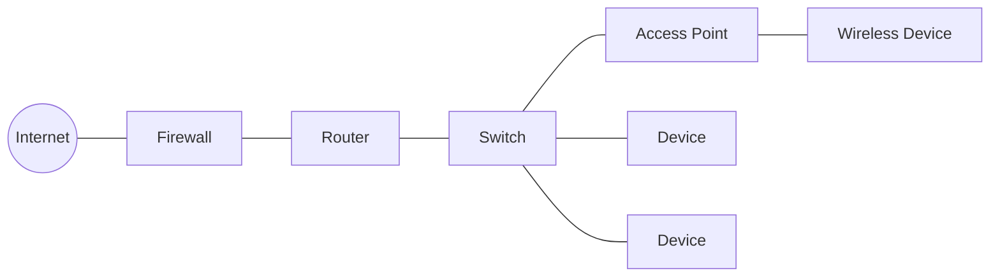
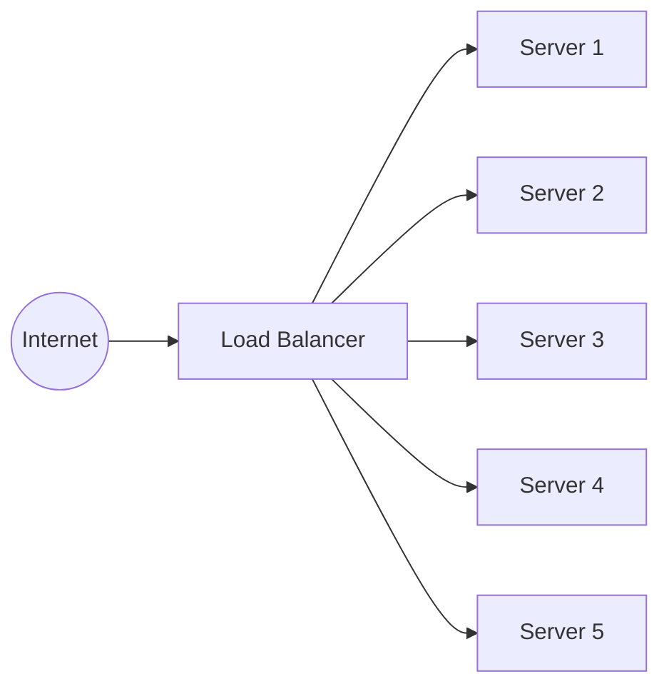
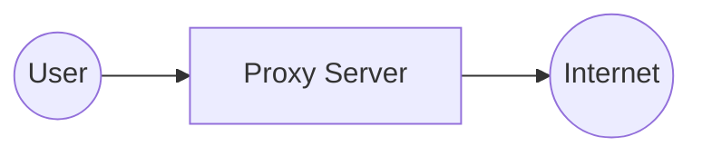

# Networking Devices & Appliances — Network+ Notes

Covers the core hardware/software appliances you'll be asked to compare and
contrast: routers, switches, firewalls, IDS/IPS, load balancers, proxies, and
storage/access appliances (NAS, SAN, AP).

---

## Routers

Routers allow us to take data from one IP subnet and route it to a different
IP subnet.

- Route traffic between IP subnets
- OSI Layer 3 device
- Sometimes called "Layer 3 switches" when a switch has routing capability
  built in

---

## Switches

A switch connects diverse devices on a network — often using copper (LAN)
or fiber (WAN) connections.

- OSI Layer 2 device
- Bridging done in hardware, using an **Application Specific Integrated
  Circuit (ASIC)** — a chip built specifically for fast, dedicated switching
- Forwards traffic based on **data link (MAC) addresses**
- **Multilayer switch** — a switch that also includes Layer 3 (routing)
  functionality
  - Provides Power over Ethernet (**PoE**) to devices
  - Sits at the core of an enterprise network
  - Many ports and features
  - Includes Layer 3 routing functionality

---

## Firewalls

Filters traffic based on port number or application, sitting between
inside and outside networks.

- **Traditional firewall** — filters by port/protocol (Layer 3/4)
- **Next-Generation Firewall (NGFW)** — adds application awareness, deep
  packet inspection, intrusion prevention, and content filtering
- Encrypts traffic between sites (VPN functionality)
- Most firewalls sit as Layer 3 devices at the ingress/outside edge of the
  network — the boundary between inside and outside

---

## IDS and IPS

**IDS** — Intrusion Detection System
**IPS** — Intrusion Prevention System

- IDS watches network traffic and detects exploits against operating
  systems, applications, etc.
- Detection vs. Prevention:
  - **Detection** — alarm or alert; steps in *before* it gets into the
    network but only warns you (doesn't block)
  - **Prevention** — actively stops the exploit: buffer overflows,
    cross-site scripting (XSS), other vulnerabilities/scripting attacks

---

## Load Balancers

Dynamically routes traffic to available network resources.

- Balances the load across multiple servers
- Very useful for large-scale implementations — invisible to the end user
- Distributes traffic across multiple servers so no single server is
  overwhelmed
- Provides **fault tolerance** — if one server goes down, users don't feel
  any effect
- Very fast convergence when a server fails

**Local balancers:**
- Configurable load — manage load across servers
- TCP offload — moves TCP session-handling overhead off the servers
- Protocol overhead handled by the balancer instead of each server
- SSL offload — encryption/decryption handled centrally, not per-server
- Content switching / application-centric balancing
- Caching — stores frequently used content to reduce repeat load
- Prioritization — QoS (Quality of Service) of service, fast response

---

## Proxies

Sits between the user and the external network — receives the user's
requests and sends them on the user's behalf.

- Used for caching information, content scanning, URL filtering
- Applications may need to know about the proxy (explicit) or it can be
  invisible to the user (**transparent**)

---

## NAS vs. SAN

**NAS — Network Attached Storage**
- Storage device that connects to a shared storage device across the
  network
- File-level access
- Looks and feels like a local storage device to the client

**SAN — Storage Area Network**
- Block-level access
- Very efficient reading/writing
- Requires a lot of bandwidth
- May use an isolated network and high-speed networking technologies

---

## Access Point (AP)

- **Not** a wireless router
- A wireless router is a router *and* an access point combined into a
  single device
- An access point extends the wired network onto the wireless network — it
  acts as a bridge
- OSI Layer 2 device