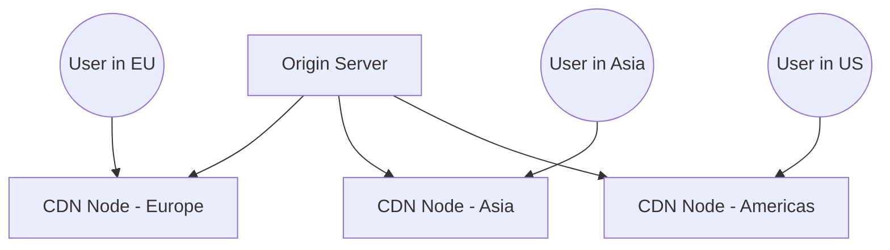
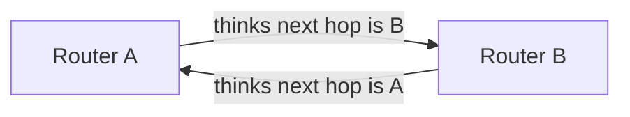

# Networking Functions, Services & IP Protocol — Network+ Notes

Covers core network functions (remote access, traffic management), CDN, VPN,
QoS, TTL, routing loops, the IPv4 header, and DNS caching behavior.

---

## Networking Functions

There's a lot happening behind the scenes — many networking functions are
part of the underlying infrastructure.

- **Access to important data** — from anywhere in the world
- **Remote Access** — secure network communication from outside the LAN
- **Traffic Management** — prioritize important applications over less
  critical ones
- **Protocol support** — maintain uptime & availability across the network

---

## Content Delivery Network (CDN)

It takes time to get data from one place to another — a CDN speeds up that
process.

- Geographically distributed caching servers
- Duplicates data across different servers around the world
- Users get the data from a **local server** that's physically near them,
  instead of the original source server — reducing latency

---

## Virtual Private Network (VPN)

Securing private data as it traverses a public network — encrypted
communication over an insecure medium (like the public internet).

- **Concentrator / head-end** — the device that handles encryption and
  decryption for VPN connections; often integrated into the firewall
- **Many deployment options:**
  - Specialized cryptographic hardware for organizations with a lot of
    concurrent users
  - Software-based options for smaller organizations
- Often used with client software; sometimes built directly into the OS

---

## Quality of Service (QoS)

Not all applications are designed to run simultaneously on a network with
equal priority — some applications matter more to an organization than
others. For example, real-time audio/video streaming usually needs higher
priority than a file transfer. Because of this, network administrators
commonly configure QoS to prioritize traffic.

- **Traffic shaping / packet shaping** — controls bandwidth usage and data
  rates
- Sets important applications to have higher priority than others
- **Managed via:** routers, switches, firewalls, and dedicated QoS devices —
  these devices need to be configured to actually provide QoS

---

## Time to Live (TTL)

How long should data be available? Not all systems or protocols are
self-regulating, so we sometimes need to tell a system when to stop.

- Creates a timer: wait until traversing a number of hops, or until a
  certain amount of time elapses, then stop (or drop)
- Many uses:
  - Drop a packet that's stuck in a routing loop
  - Clear a cache

---

## Routing Loops

If a network has multiple routers, it's possible for Router A to think the
next hop is Router B, while Router B thinks the next hop is back to Router
A — this repeats endlessly.

- Easy to misconfigure, especially with **static routing**
- Since routers can have many different routes, it's easy to make a single
  IP addressing mistake in a static route and accidentally create a loop
- **Fix:** the TTL field inside the IP packet identifies and automatically
  stops a loop if one occurs

---

## IP (Internet Protocol) & TTL in Practice

Routing loops could cause a packet to live forever — TTL prevents that by
dropping the packet after a certain number of hops.

- Each pass through a router is one **hop**
- Default TTL: **64 hops** on macOS/Linux, **128 hops** on Windows
- The router decrements TTL by 1 at each hop
- A packet with TTL = 0 is dropped by the router
- In most cases, the total number of hops between you and a destination on
  the internet is usually around **22–26 hops** (sometimes more, sometimes
  less)

### IPv4 Header Structure (4 bytes per row)

| Field | Field | Field | Field |
|---|---|---|---|
| Version | Header Length | Type of Service | Total Length |
| Identification (spans) | | Flags | Fragment Offset |
| Time to Live | Protocol | Header Checksum | |
| Source IP Address (spans full row) | | | |
| Destination IP Address (spans full row) | | | |
| Options & Padding (spans full row) | | | |

This entire structure is the **IPv4 header**. Every router along the path
reads the **Time to Live** field to determine whether it should forward the
packet or discard it from the network.

---

## DNS (Domain Name System) & TTL

TTL means something different depending on the protocol:
- With **routers**, TTL = number of hops
- With **DNS**, TTL = number of **seconds**

- A DNS lookup resolves an IP address from a fully-qualified domain name
  - Example: `www.professormesser.com` → `172.67.41.114`
- A device (computer/OS) or router **caches** that lookup result for a
  certain amount of time — determined by the DNS record's TTL value
- You can check a domain's TTL yourself using `dig`

**Example:** if a DNS record's TTL is 5 minutes, and you look up that domain
again after 5 minutes, your device performs a fresh DNS query to update its
cache. This lets a web server administrator change the IP address in their
DNS configuration and feel reasonably confident that most people will pick
up the updated IP within that TTL window (e.g., 5 minutes).