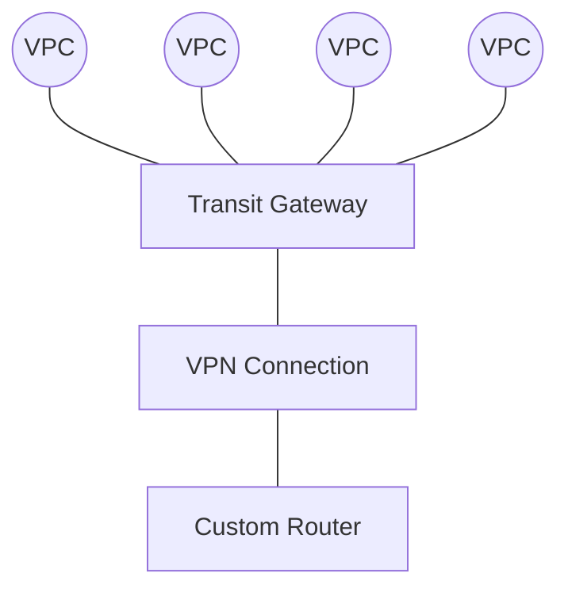
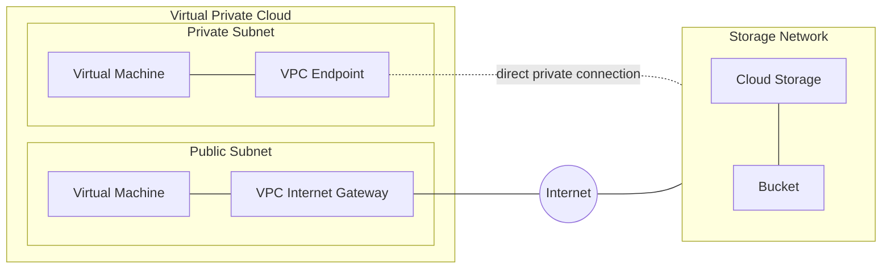
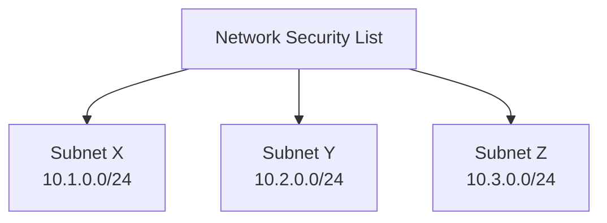

# Cloud Concepts & Virtual Networks — Network+ Notes

Covers cloud design principles, Network Function Virtualization (NFV),
Virtual Private Clouds (VPCs), Transit Gateways, VPC NAT Gateways/Endpoints,
and cloud-based security controls (Security Groups & Network Security Lists).

---

## Designing the Cloud

- **On-demand computing power**
- **Elasticity** — scale up or down as needed
- **Applications also scale:**
  - Scalability for large implementations
  - Access from anywhere
- **Multitenancy** — many different clients using the same shared cloud
  infrastructure

---

## Virtual Networks

We can virtualize our network too — this is called **Network Function
Virtualization (NFV)**.

- Replaces physical network devices with virtual versions
- Managed through the **hypervisor**
- Has the same functionality as a physical device — routing, switching,
  load balancing, firewalls, etc. — just no longer physical hardware
- Just like clicking a button to launch a new server, you can install a
  virtual firewall or router with a single click, or configure a router/
  switch entirely within the virtualized network
- Many deployment options: virtual machines, containers, fault tolerance,
  etc.

---

## Connecting the Clouds

A common application instance inside cloud infrastructure might include a
web server and a database server. There could also be load balancers,
virtual switches, virtual routers, and virtual firewalls — all of this runs
inside a **Virtual Private Cloud (VPC)**.

It's common to create many VPCs — separate VPCs for different application
instances, or for different parts of a company.

### Transit Gateway

To let all these VPCs communicate with each other, we need a device called
a **Transit Gateway** — it connects all the VPCs together.

If we need connectivity to those VPCs from outside, we may need to add
additional security in the form of a **VPN connection**. This allows someone
at a remote site to establish a VPN tunnel, connect to the transit gateway,
and effectively communicate with all the different VPCs.

- **VPN** → site-to-site VPN through the internet
- **Virtual Private Cloud Gateway / Internet Gateway** — connects users on
  the internet
- **VPC NAT Gateway**
  - Uses Network Address Translation (NAT)
  - Private cloud subnets connect *out* to external resources
  - External resources **cannot** access the private cloud directly
- **VPC Endpoint**
  - A direct, private connection between cloud provider networks — traffic
    doesn't need to traverse the public internet

---

## Virtual Private Cloud Endpoints — Example Architecture

A VPC typically has a **public subnet** (for apps people access from
anywhere on the internet) and a **private subnet** (not reachable from the
internet) within the same cloud provider. There might also be a separate
**storage network** — potentially on a different cloud platform — that
cloud storage needs to reach.

- The public subnet's internet gateway lets the cloud storage reach it over
  the existing internet
- The private subnet **isn't accessible from the internet at all**
- So a **VPC Endpoint** is added between cloud storage and the private
  subnet, letting them communicate directly and privately — without going
  over the public internet

---

## Security Groups & Network Security Lists

Many cloud providers include additional security you can layer on top of
your VPCs. **Security groups** and **network security lists** act as
firewalls for your cloud-based services — controlling what traffic can go
outbound and inbound to your VPCs.

- Mostly based on **port number and protocol**
  - Define TCP/UDP port numbers and add them to outbound/inbound rules
- Can also add **Layer 3 addresses**:
  - Individual IP addresses
  - A block of IP addresses using **CIDR block notation**
  - Or specify IPv4/IPv6 ranges directly

### Network Security List

Assigns a security rule to an **entire IP subnet** — it applies to *all*
devices in that subnet.

| Direction | Protocol | Port | IP Address |
|---|---|---|---|
| Inbound | TCP | 443 | 0.0.0.0/0 |
| Inbound | TCP | 22 | 0.0.0.0/0 |

- **Very broad** — can become difficult to manage
- Not all devices in the subnet necessarily need the same security posture
- More granularity may be needed — a broad rule may not provide the right
  level of security for every device

### Network Security Group

Assigns a security rule to a **specific virtual network interface (NIC)** —
it applies only to specific devices and network connections.

- More granular than a network security list
- You can add different rules for devices that sit in the *same* IP subnet
- If you need additional security beyond this, look into a virtual firewall
  or other virtualized security platform