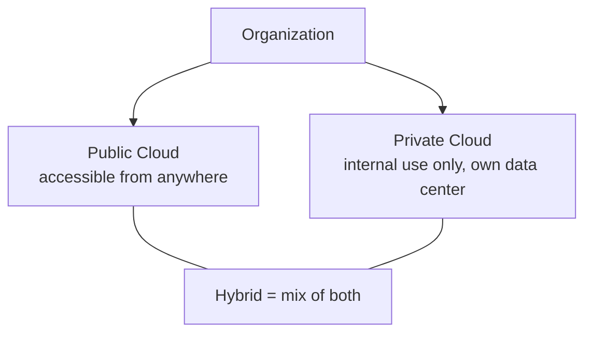

# Cloud Models — Network+ Notes

Covers cloud **deployment** models (public, private, hybrid) and cloud
**service** models (SaaS, PaaS, IaaS).

---

## Cloud Deployment Models

Whenever we deploy an application to the cloud, we need to consider **who**
will access it and **from where**.

- **Public Cloud** — if anyone should be able to access it from anywhere in
  the world
- **Private Cloud** — if the application is for internal use only, deploy it
  to your own virtualized local data center
- **Hybrid Cloud** — when an organization has both public and private
  applications running together

---

## Cloud Service Models

The three models differ mainly in **how much you manage** vs. **how much
the provider manages**.

### Software as a Service (SaaS)

Commonly associated with software you access **on demand**, logging in
through a browser — you're using the application without writing it
yourself or running any local installation.

- A **complete application offering** — no development work required
- Data is stored and managed entirely by a third-party cloud provider
- Allows central management of data and applications
- **Examples:** Google Mail, Office 365

### Infrastructure as a Service (IaaS)

Like creating your own application and managing your own data — all you
really need from the provider is the **computing resources** to run it.

- Also referred to as **Hardware as a Service (HaaS)**
- You're still responsible for management **and** security of what you
  deploy
- Your data is out there, but much more within your control
- **Example:** web server hosting providers

### Platform as a Service (PaaS)

A **middle ground** between SaaS and IaaS. In this model, the provider
manages all the underlying development infrastructure/effort for you.

- You don't have direct control over the data, people, or infrastructure —
  trained security professionals at the provider are watching/managing that
  for you
- Choose your platform carefully
- You develop your app using whatever tools/services are available on that
  platform
- **Example:** Salesforce.com (build custom apps on their platform without
  managing the underlying servers)

---

### Quick comparison

| Model | You manage | Provider manages | Example |
|---|---|---|---|
| **SaaS** | Nothing — just use the app | Everything | Gmail, Office 365 |
| **PaaS** | Your app & data | Infrastructure, runtime, security | Salesforce.com |
| **IaaS** | App, data, runtime, OS | Physical hardware/computing resources | Web hosting providers |