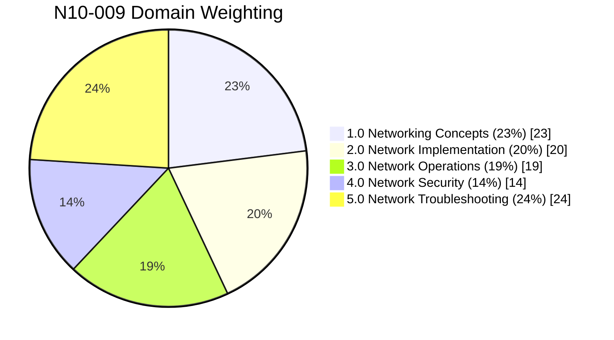

# Progress Tracker — N10-009

Tracking progress against the official CompTIA Network+ (N10-009) exam
domains. Percentages = weight of that domain on the actual exam — use this to
prioritize study time (Troubleshooting and Networking Concepts carry the most
weight).

> Exam format: up to 90 questions (multiple-choice + performance-based),
> 90 minutes, passing score 720/900.

---

## 1.0 Networking Concepts — 23%
- [x] OSI Model — [notes](01-osi-model.md)
- [x] Networking appliances, applications, and functions — [notes](02-networking-devices.md)
- [ ] Cloud concepts and connectivity options (IaaS/PaaS/SaaS, public/private/hybrid)
- [ ] Common ports, protocols, services, and traffic types
- [ ] Transmission media and transceivers (copper, fiber, SFP/QSFP)
- [ ] Network topologies, architectures, and types (mesh, star, spine-leaf, etc.)
- [ ] IPv4 addressing (subnetting, CIDR, VLSM, public/private)
- [ ] IPv6 addressing concepts
- [ ] Modern network environment use cases (SDN, SD-WAN, IaC, VXLAN)

## 2.0 Network Implementation — 20%
- [ ] Routing technologies and concepts
- [ ] Switching technologies (VLANs, trunking, STP, link aggregation)
- [ ] Wireless devices and technologies (SSID, channels, encryption, WPA2/WPA3)
- [ ] Physical installation factors (MDF/IDF, rack layout, cable management)

## 3.0 Network Operations — 19%
- [ ] Organizational processes and procedures (documentation, change management)
- [ ] Network monitoring technologies (SNMP, flow data, packet capture, SIEM)
- [ ] Disaster recovery concepts (RPO, RTO, MTTR, MTBF, DR sites)
- [ ] IPv4/IPv6 network services (DHCP, DNS, NTP)
- [ ] Network access and management methods (VPN, SSH, jump box, in-band/out-of-band)

## 4.0 Network Security — 14%
- [ ] Basic network security concepts (encryption, PKI, IAM, MFA)
- [ ] Common attacks and their impact (DoS/DDoS, ARP/DNS poisoning, evil twin, social engineering)
- [ ] Security features, defense techniques, and solutions (NAC, ACLs, device hardening, zones)

## 5.0 Network Troubleshooting — 24%
- [ ] Troubleshooting methodology
- [ ] Cable and physical layer issues (attenuation, crosstalk, wrong cable type)
- [ ] Network service issues (DHCP/DNS problems)
- [ ] Performance issues (latency, jitter, bandwidth)
- [ ] Wireless issues (interference, channel overlap, signal strength)
- [ ] Security-related troubleshooting scenarios

---

**Legend:** ✅ = notes written & reviewed · ⬜ = not started yet

*Sub-objective numbering above is simplified for tracking purposes — refer to
the official CompTIA N10-009 objectives document for exact wording before
exam day.*